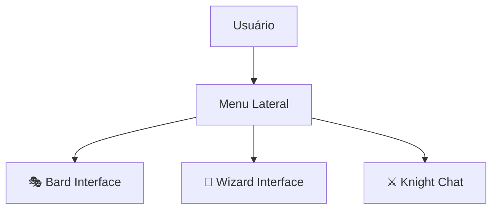
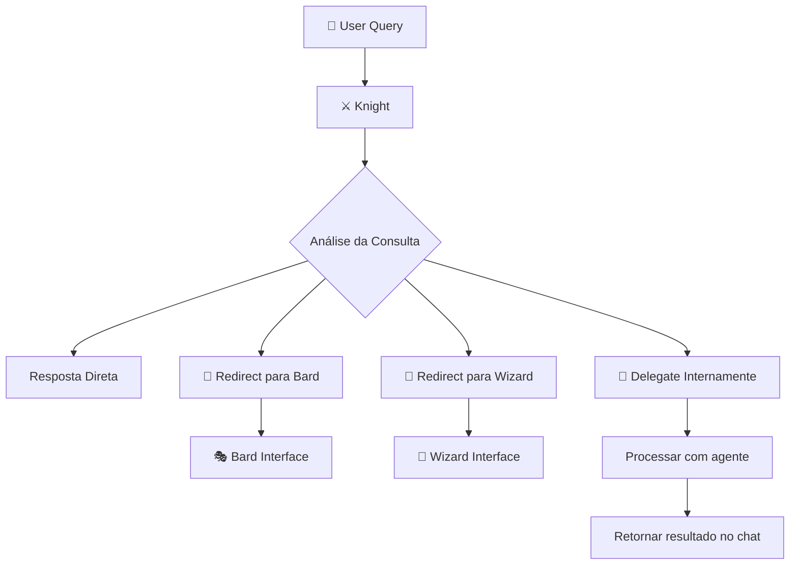

# 🤖 Knight Multi-Agent System Architecture

## 📋 Visão Geral

O sistema Knight implementa uma arquitetura multi-agêntica baseada em **LangGraph** com padrão **Supervisor**, onde cada agente possui interface especializada e o Knight Agent atua como coordenador principal.

## 🏗️ Arquitetura do Sistema

### Frontend - Interfaces Especializadas
```
🔐 Login → 🔄 Redirect automático para /chat (Knight)

Menu Lateral de Navegação:
├── ⚔️ Knight - Chat Assistente (PÁGINA PRINCIPAL)
├── 🎭 Bard - Central de Relatórios  
├── 🧙 Wizard - Capacitações & Desenvolvimento
├── 📊 Dashboard - Métricas e Visão Geral
├── 📁 Documentos - Gestão de Arquivos (Admin)
└── ⚙️ Configurações - Preferências do Usuário
```

### Backend - LangGraph Multi-Agent System
```python
LangGraph StateGraph:
├── Knight Agent (Supervisor)
│   ├── Responde diretamente para consultas gerais
│   ├── Delega para agentes especializados quando necessário  
│   ├── Pode redirecionar usuários para interfaces dedicadas
│   └── Coordena handoffs inteligentes entre agentes
│
├── Bard Agent (Especialista em Relatórios)
│   ├── Análise de dados e métricas
│   ├── Geração de relatórios PDF/Excel
│   ├── Visualizações com gráficos interativos
│   └── Insights baseados em IA
│
└── Wizard Agent (Especialista em Capacitações)
    ├── Criação de trilhas de aprendizado
    ├── Acompanhamento de onboarding
    ├── Recomendações personalizadas
    └── Gestão de certificações
```

## 🎯 Especialização dos Agentes

### ⚔️ Knight Agent - Supervisor & Chat Principal
**Interface**: `/chat` (página padrão após login)

**Responsabilidades**:
- 🎯 **Supervisor Principal**: Coordena todos os outros agentes
- 💬 **Chat Geral**: Responde consultas sobre documentos, processos, dúvidas
- 🧠 **Roteamento Inteligente**: Decide quando delegar para especialistas
- 🔗 **Handoffs**: Redireciona usuários para interfaces especializadas
- 📚 **RAG Tradicional**: Busca e consulta documentos corporativos

**Exemplos de Uso**:
```
👤 User: "Como funciona o processo de férias?"
⚔️ Knight: [Busca nos documentos e responde diretamente]

👤 User: "Quero um relatório das minhas capacitações"  
⚔️ Knight: "Posso dar informações básicas, mas para relatórios 
          detalhados com gráficos, use o Bard! 
          🎭 [Link: Ir para Relatórios]"

👤 User: "Preciso de uma trilha de desenvolvimento para júnior"
⚔️ Knight: "O Wizard é especialista nisso! Vou te redirecionar...
          🧙 [Link: Ir para Capacitações]"
```

### 🎭 Bard Agent - Central de Relatórios
**Interface**: `/bard` (acesso via menu lateral)

**Responsabilidades**:
- 📊 **Análise de Dados**: Métricas de uso, performance, engajamento
- 📈 **Relatórios Inteligentes**: PDFs com gráficos e insights
- 🎨 **Visualizações**: Charts interativos (Recharts)
- 🤖 **IA Analytics**: Insights automatizados sobre padrões de uso
- 📤 **Exportação**: PDF, Excel, JSON com dados estruturados

**Fluxos de Trabalho**:
1. **Coleta de Dados**: Extrai informações do banco sobre uso
2. **Análise IA**: LLM analisa padrões e gera insights
3. **Geração Visual**: Cria gráficos e dashboard
4. **Exportação**: Formatos múltiplos para download

### 🧙 Wizard Agent - Capacitações & Desenvolvimento  
**Interface**: `/wizard` (acesso via menu lateral)

**Responsabilidades**:
- 🎓 **Trilhas Personalizadas**: Baseadas em cargo, nível, departamento
- 📋 **Onboarding**: Acompanhamento de integração de novos funcionários
- 🏆 **Certificações**: Recomendações e tracking de progresso
- 🎯 **Recomendações IA**: Sugestões baseadas no perfil do usuário
- 📈 **Progress Tracking**: Acompanhamento de evolução

**Fluxos de Trabalho**:
1. **Análise de Perfil**: Avalia cargo, experiência, interesses
2. **Criação de Trilha**: IA monta plano personalizado
3. **Tracking**: Monitora progresso e oferece feedback
4. **Recomendações**: Sugere próximos passos e certificações

## 🔄 Padrões de Interação

### 1. Acesso Direto


### 2. Handoffs Inteligentes


### 3. Cross-Agent Communication
```python
# Knight pode chamar outros agentes internamente
Knight: "Preciso de dados para um relatório..."
Knight → Bard Agent (interno)
Bard → Retorna dados estruturados
Knight → Apresenta resumo no chat + link para detalhes
```

## 🛠️ Implementação Técnica

### LangGraph State Management
```python
class MultiAgentState(TypedDict):
    """Estado compartilhado entre todos os agentes"""
    query: str
    messages: List[BaseMessage]
    current_agent: str
    task_type: Literal["general", "report", "training"]
    user_context: Dict[str, Any]
    handoff_target: Optional[str]
    response_data: Dict[str, Any]
```

### Supervisor Decision Logic
```python
def knight_supervisor_node(state: MultiAgentState) -> Command:
    """Knight decide se responde ou delega"""
    query = state["query"]
    
    # Análise da consulta com LLM
    task_analysis = analyze_query_intent(query)
    
    if task_analysis["type"] == "report_generation":
        return Command(
            goto="bard_agent",
            update={"task_type": "report", "handoff_target": "bard"}
        )
    elif task_analysis["type"] == "training_related":
        return Command(
            goto="wizard_agent", 
            update={"task_type": "training", "handoff_target": "wizard"}
        )
    else:
        return Command(
            goto="knight_response",
            update={"task_type": "general"}
        )
```

### Agent Handoff Tools
```python
@tool
def redirect_to_bard():
    """Redireciona usuário para interface do Bard"""
    return Command(
        goto="suggest_bard_interface",
        update={"suggestion": "Para relatórios detalhados, use o Bard!"}
    )

@tool  
def redirect_to_wizard():
    """Redireciona usuário para interface do Wizard"""
    return Command(
        goto="suggest_wizard_interface", 
        update={"suggestion": "Para capacitações, use o Wizard!"}
    )
```

## 📱 User Experience Flows

### Cenário 1: Consulta Geral
```
👤 "Como solicitar férias?"
⚔️ Knight busca documentos → Responde diretamente no chat
✅ Usuário continua no /chat
```

### Cenário 2: Necessidade de Relatório
```  
👤 "Preciso de um relatório de performance"
⚔️ Knight analisa → Detecta necessidade de relatório
⚔️ "Para relatórios completos, recomendo o Bard! 
   🎭 [Botão: Ir para Central de Relatórios]"
👤 Clica → Navega para /bard
🎭 Bard gera relatório com gráficos e análises
```

### Cenário 3: Trilha de Capacitação
```
👤 "Quero me desenvolver em liderança"  
⚔️ Knight analisa → Detecta necessidade de capacitação
⚔️ "O Wizard é especialista em desenvolvimento! 
   🧙 [Botão: Criar Trilha de Capacitação]"
👤 Clica → Navega para /wizard
🧙 Wizard cria trilha personalizada baseada no perfil
```

### Cenário 4: Handoff Interno
```
👤 "Me dê um resumo do meu progresso de capacitações"
⚔️ Knight → Chama Wizard internamente
🧙 Wizard → Retorna dados estruturados
⚔️ Knight → Apresenta resumo no chat + 
   "Para detalhes completos: 🧙 [Ver no Wizard]"
```

## 🚀 Benefícios da Arquitetura

### Para o Usuário
- 🎯 **Entrada Única**: Sempre começa no Knight (familiar)
- 🎨 **Interfaces Especializadas**: UX otimizada por domínio  
- 🔄 **Fluxo Natural**: Redirecionamentos inteligentes
- 📱 **Flexibilidade**: Acesso direto ou via supervisor

### Para o Sistema
- 🧠 **Inteligência Distribuída**: Cada agente é expert em seu domínio
- 🔧 **Modularidade**: Fácil adicionar novos agentes especializados
- ⚡ **Performance**: Cargas distribuídas por especialização
- 🛠️ **Manutenibilidade**: Código organizado por responsabilidade

### Para Desenvolvimento  
- 📦 **Reutilização**: Infraestrutura LangGraph compartilhada
- 🧪 **Testabilidade**: Agentes isolados são mais fáceis de testar
- 📈 **Escalabilidade**: Adicionar novos agentes sem afetar existentes
- 🔍 **Observabilidade**: Tracking individual por agente

## 🔮 Evolução Futura

### Próximos Agentes Possíveis
- 🏢 **Manager Agent**: Para gestores - relatórios de equipe, aprovações
- 🎫 **Support Agent**: Tickets, chamados, suporte técnico  
- 📅 **Calendar Agent**: Agendamentos, reuniões, eventos
- 💰 **Finance Agent**: Relatórios financeiros, orçamentos
- 🔐 **Security Agent**: Compliance, auditoria, políticas

### Funcionalidades Avançadas
- 🤝 **Multi-Agent Collaboration**: Agents trabalhando em conjunto
- 🧠 **Context Sharing**: Estado compartilhado entre agentes
- 📊 **Agent Analytics**: Métricas de performance por agente
- 🎯 **Smart Routing**: ML para melhorar decisões de handoff
- 🔄 **Workflow Automation**: Fluxos automatizados entre agentes

---

## 🎯 Conclusão

Esta arquitetura multi-agêntica oferece o melhor dos dois mundos:
- **Simplicidade**: Usuários sempre começam no Knight familiar
- **Especialização**: Interfaces otimizadas para casos específicos
- **Inteligência**: Roteamento automático baseado em contexto
- **Flexibilidade**: Acesso direto quando o usuário sabe o que quer

O resultado é um sistema poderoso que escala com as necessidades da organização mantendo uma experiência de usuário natural e intuitiva.