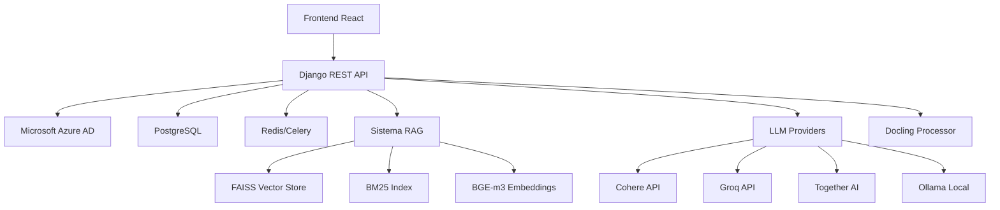

# 🏰 Knight Agent - Assistente IA Interno

> **Sistema completo de IA corporativa para atendimento interno com RAG híbrido e suporte múltiplos provedores LLM**

[](https://www.python.org/)
[](https://www.djangoproject.com/)
[](https://react.dev/)
[](https://www.docker.com/)

## 🎯 Sobre o Projeto

O Knight Agent é um sistema completo de assistente IA projetado especificamente para empresas que precisam de um agente interno inteligente. Ele combina RAG (Retrieval-Augmented Generation) híbrido otimizado para português com uma arquitetura flexível que suporta múltiplos provedores LLM.

### 🌟 Diferenciais

- **RAG Híbrido Otimizado**: Combina busca semântica (BGE-m3) + BM25 para máxima relevância
- **Suporte Múltiplos LLMs**: APIs externas (Cohere, Groq, Together AI) + self-hosted (Ollama)
- **Processamento Inteligente**: Docling para conversão otimizada de documentos
- **Autenticação Empresarial**: Integração nativa com Microsoft Azure AD
- **Otimizado para Português**: Chunking e embeddings especializados para nossa língua
- **Downloads Temporários**: Sistema seguro de distribuição de documentos (7 dias)

## 🏗️ Arquitetura



### Stack Tecnológico

#### Backend
- **Framework**: Django 5.0 + Django REST Framework
- **Autenticação**: Microsoft Azure AD + MSAL
- **Banco de Dados**: PostgreSQL (produção) / SQLite (desenvolvimento)
- **Cache/Queue**: Redis + Celery
- **RAG Engine**: LangChain + FAISS + BM25
- **Embeddings**: BGE-m3 (multilingual, otimizado para português)
- **Processamento**: Docling + PyPDF2 + python-docx

#### Frontend
- **Framework**: Next.js 14 + TypeScript
- **UI**: Tailwind CSS + Lucide Icons
- **Estado**: React Query + Context API
- **Autenticação**: MSAL React

#### LLM Providers
- **Cohere**: RAG nativo, otimizado para produção
- **Groq**: Ultra-baixa latência (<500ms)
- **Together AI**: Variedade de modelos open-source
- **Ollama**: Self-hosted, dados internos, zero custo por token

## 📁 Estrutura Completa do Projeto

```
knight-agent/
├── 📁 backend/                    # Django REST API
│   ├── 📁 knight_backend/         # Configurações principais Django
│   ├── 📁 authentication/         # Sistema auth Microsoft Azure AD
│   │   ├── models.py              # User customizado + Sessions
│   │   ├── views.py               # Login/logout Microsoft
│   │   ├── services.py            # MSAL integration
│   │   └── backends.py            # Custom auth backend
│   ├── 📁 documents/              # Processamento documentos
│   │   ├── models.py              # Document + Chunks + Jobs
│   │   ├── services.py            # Docling processor
│   │   ├── tasks.py               # Celery async processing
│   │   └── views.py               # Upload/download API
│   ├── 📁 rag/                    # Sistema RAG híbrido
│   │   ├── models.py              # VectorStore + SearchQuery
│   │   ├── services.py            # Hybrid search engine
│   │   ├── llm_providers.py       # Multiple LLM support
│   │   └── views.py               # Search API
│   ├── 📁 chat/                   # Interface de chat
│   │   ├── models.py              # ChatSession + Messages
│   │   ├── services.py            # Knight chat logic
│   │   └── views.py               # Chat API endpoints
│   ├── 📁 downloads/              # Downloads temporários
│   │   ├── models.py              # DownloadRecord (7 dias)
│   │   └── views.py               # Download management
│   ├── requirements.txt           # Dependências Python
│   ├── Dockerfile                 # Container Django
│   └── .env.example              # Variáveis ambiente
├── 📁 frontend/                   # Next.js Application
│   ├── 📁 src/
│   │   ├── 📁 components/         # Componentes React
│   │   │   ├── Layout.tsx         # Layout principal
│   │   │   ├── ChatInterface.tsx  # Interface chat
│   │   │   ├── ProtectedRoute.tsx # Auth guard
│   │   │   └── ...
│   │   ├── 📁 pages/              # Páginas da aplicação
│   │   │   ├── LoginPage.tsx      # Login Microsoft
│   │   │   ├── ChatPage.tsx       # Chat principal
│   │   │   ├── DashboardPage.tsx  # Dashboard
│   │   │   └── DownloadsPage.tsx  # Gerenciar downloads
│   │   ├── 📁 services/           # API clients
│   │   ├── 📁 hooks/              # Custom React hooks
│   │   └── 📁 context/            # Auth + Theme context
│   ├── package.json               # Dependências Node.js
│   ├── Dockerfile                 # Container React
│   └── tailwind.config.js         # Configuração CSS
├── 📁 docs/                       # Documentação completa
│   ├── INSTALLATION.md           # Guia instalação detalhado
│   ├── API.md                     # Documentação completa API
│   ├── DEPLOYMENT.md              # Deploy produção + DevOps
│   └── LLM_PROVIDERS.md           # Configuração LLMs
├── 📁 scripts/                    # Scripts automação
│   ├── install.sh                 # Instalação automática
│   ├── deploy.sh                  # Deploy produção
│   └── backup.sh                  # Backup automático
├── docker-compose.yml             # Desenvolvimento
├── docker-compose.prod.yml        # Produção
└── README.md                      # Este arquivo
```

## 🚀 Instalação Rápida

### Opção 1: Script Automático (Recomendado)
```bash
git clone https://github.com/sua-empresa/knight-agent.git
cd knight-agent
chmod +x scripts/install.sh
./scripts/install.sh
```

### Opção 2: Docker Compose
```bash
git clone https://github.com/sua-empresa/knight-agent.git
cd knight-agent
cp backend/.env.example backend/.env
# Configure suas credenciais no .env
docker-compose up -d
```

### Opção 3: Desenvolvimento Local
```bash
# Backend
cd backend
python -m venv venv
source venv/bin/activate
pip install -r requirements.txt
python manage.py migrate
python manage.py runserver

# Frontend (novo terminal)
cd frontend
npm install
npm start
```

## ⚙️ Configuração Essencial

### 1. Microsoft Azure AD (Obrigatório)
```env
# backend/.env
AZURE_AD_CLIENT_ID=seu-client-id
AZURE_AD_CLIENT_SECRET=seu-client-secret
AZURE_AD_TENANT_ID=seu-tenant-id
AZURE_AD_REDIRECT_URI=http://localhost:8000/auth/microsoft/callback/
```

### 2. Provedor LLM (Escolha um)
```env
# Cohere (Recomendado para produção)
LLM_PROVIDER=cohere
COHERE_API_KEY=sua-cohere-api-key

# Groq (Melhor velocidade)
LLM_PROVIDER=groq
GROQ_API_KEY=sua-groq-api-key

# Ollama (Self-hosted)
LLM_PROVIDER=ollama
OLLAMA_BASE_URL=http://localhost:11434
OLLAMA_MODEL=llama3.2
```

### 3. Configurações RAG Otimizadas para Português
```env
# Já configurado para português
EMBEDDING_MODEL=BAAI/bge-m3
CHUNK_SIZE=700
CHUNK_OVERLAP=100
BM25_WEIGHT=0.3
SEMANTIC_WEIGHT=0.7
```

## 🤖 Provedores LLM Detalhados

| Provedor | Latência | Qualidade | Custo | RAG Nativo | Recomendação |
|----------|----------|-----------|--------|------------|--------------|
| **Cohere** | Média (800ms) | ⭐⭐⭐⭐⭐ | Médio | ✅ | **Produção** |
| **Groq** | Baixa (200ms) | ⭐⭐⭐⭐ | Baixo | ❌ | **Performance** |
| **Together AI** | Alta (1200ms) | ⭐⭐⭐ | Baixo | ❌ | **Experimentação** |
| **Ollama** | Variável | ⭐⭐⭐⭐ | Zero | ❌ | **Privacidade** |

### Configuração Rápida por Ambiente

#### Desenvolvimento
```bash
# Use Ollama local (sem custos)
ollama pull llama3.2:1b
export LLM_PROVIDER=ollama
```

#### Produção
```bash
# Use Cohere (melhor qualidade RAG)
export LLM_PROVIDER=cohere
export COHERE_API_KEY=sua-api-key
```

## 📚 Funcionalidades Principais

### 🔐 Autenticação Empresarial
- Login único via Microsoft Azure AD
- Sincronização automática de dados corporativos
- Controle de acesso baseado em grupos AD
- Sessões seguras com tokens JWT

### 💬 Chat Inteligente
- Interface conversacional intuitiva
- Histórico persistente de conversas
- Suporte a markdown nas respostas
- Feedback de qualidade das respostas
- Redirecionamento automático para RH quando necessário

### 📄 Processamento de Documentos
- **Formatos suportados**: PDF, DOCX, DOC, XLSX, XLS, PPTX, PPT, TXT, MD
- **Processamento**: Docling para conversão otimizada para markdown
- **Chunking inteligente**: Preserva estrutura (cabeçalhos, parágrafos)
- **Embeddings**: BGE-m3 multilingual otimizado para português
- **Indexação**: FAISS (semântica) + BM25 (keyword) híbrida

### 🔍 Sistema RAG Híbrido
```python
# Busca otimizada que combina:
semantic_results = vector_search.search(query)  # BGE-m3 embeddings
bm25_results = keyword_search.search(query)     # BM25 keyword search
final_results = combine_scores(semantic_results, bm25_results, weights=[0.7, 0.3])
```

### 📥 Downloads Temporários
- Documentos ficam disponíveis por 7 dias
- Links únicos e seguros
- Controle de acesso por usuário
- Limpeza automática após expiração

### 🎨 Interface Responsiva
- **Temas**: Light/Dark mode
- **Perfil**: Upload de foto, nome preferido
- **Dashboard**: Estatísticas de uso
- **Mobile**: Interface otimizada para celular

## 📖 Documentação Completa

| Documento | Descrição |
|-----------|-----------|
| [📋 INSTALLATION.md](docs/INSTALLATION.md) | Guia completo instalação + troubleshooting |
| [🔌 API.md](docs/API.md) | Documentação completa da API REST |
| [🚀 DEPLOYMENT.md](docs/DEPLOYMENT.md) | Deploy produção + DevOps |
| [🤖 LLM_PROVIDERS.md](docs/LLM_PROVIDERS.md) | Configuração detalhada LLMs |

## 🏢 Configuração Empresarial

### 1. Upload de Documentos Internos
```bash
# Via interface web (recomendado)
1. Login como admin
2. Acesse /admin/documents/
3. Upload documentos
4. Marque como "downloadable" se necessário

# Via API
curl -X POST http://localhost:8000/api/documents/upload/ \
  -H "Authorization: Bearer TOKEN" \
  -F "file=@manual-funcionario.pdf" \
  -F "title=Manual do Funcionário" \
  -F "is_downloadable=true"
```

### 2. Processamento Automático
- ✅ Conversão para Markdown (Docling)
- ✅ Divisão em chunks otimizados (500-800 tokens)
- ✅ Geração de embeddings (BGE-m3)
- ✅ Indexação híbrida (FAISS + BM25)
- ✅ Disponibilização para chat

### 3. Monitoramento
```bash
# Logs em tempo real
docker-compose logs -f backend

# Métricas de uso
curl http://localhost:8000/api/stats/

# Health check
curl http://localhost:8000/health/
```

## 🚀 Deploy em Produção

### Docker (Recomendado)
```bash
# Produção com HTTPS + PostgreSQL + Redis
git clone repo
cd knight-agent
cp backend/.env.example backend/.env.prod
# Configure credenciais produção
docker-compose -f docker-compose.prod.yml up -d
```

### Cloud Providers
- **AWS**: ECS + RDS + ElastiCache
- **Azure**: Container Instances + PostgreSQL + Redis
- **GCP**: Cloud Run + Cloud SQL + Memorystore

## 🔧 Customização Avançada

### 1. Personalizar Prompt do Knight
```python
# backend/rag/llm_providers.py
KNIGHT_PROMPT = """
Você é o Knight, assistente IA da [SUA_EMPRESA].
Suas especializações:
- Políticas internas e RH
- Procedimentos operacionais
- Benefícios e férias
- [Adicione áreas específicas]

Sempre responda em português brasileiro de forma:
- Profissional mas amigável
- Baseado apenas nos documentos fornecidos
- Sugerindo contato RH quando necessário
"""
```

### 2. Configurar Embeddings Customizados
```python
# Para documentos muito específicos da sua empresa
from sentence_transformers import SentenceTransformer

# Fine-tunar modelo para seu domínio
model = SentenceTransformer('BAAI/bge-m3')
# Treinar com documentos da empresa...
```

### 3. Integração com Sistemas Internos
```python
# Webhook para integração com outros sistemas
@api_view(['POST'])
def external_integration(request):
    # Integrar com ERP, CRM, etc.
    pass
```

## 📊 Métricas e Analytics

### Dashboard Administrativo
- Total de usuários ativos
- Documentos processados
- Queries por dia/semana/mês
- Satisfação das respostas (feedback)
- Performance por provedor LLM
- Documentos mais consultados

### Logs Estruturados
```json
{
  "timestamp": "2024-01-01T12:00:00Z",
  "user": "joao.silva@empresa.com",
  "query": "como solicitar férias",
  "response_time_ms": 850,
  "provider": "cohere",
  "documents_used": 3,
  "satisfaction": "helpful"
}
```

## 🔒 Segurança e Compliance

### Proteção de Dados
- ✅ Dados corporativos ficam internos (Ollama option)
- ✅ Criptografia em trânsito (HTTPS/TLS)
- ✅ Autenticação multi-fator via Azure AD
- ✅ Logs auditáveis de todas as interações
- ✅ Controle granular de acesso a documentos

### LGPD/GDPR Ready
- ✅ Anonimização de logs
- ✅ Direito ao esquecimento
- ✅ Consentimento explícito
- ✅ Relatórios de acesso a dados

## 🤝 Contribuição

### Roadmap
- [ ] **Integração WhatsApp Business** (próxima versão)
- [ ] **Multi-tenant** support
- [ ] **Analytics avançados** com BI
- [ ] **Integração SharePoint/OneDrive**
- [ ] **Suporte a imagens** nos documentos
- [ ] **Speech-to-text** para queries por voz

### Como Contribuir
1. Fork o projeto
2. Crie uma branch para sua feature
3. Commit suas mudanças
4. Abra um Pull Request

## 📞 Suporte

### Comunidade
- **Issues**: [GitHub Issues](https://github.com/sua-empresa/knight-agent/issues)
- **Discussões**: [GitHub Discussions](https://github.com/sua-empresa/knight-agent/discussions)
- **Email**: knight-support@suaempresa.com

### Suporte Comercial
Para implementação empresarial, customizações e suporte dedicado:
- **Email**: sales@suaempresa.com
- **LinkedIn**: [Perfil da Empresa](https://linkedin.com/company/suaempresa)

## 📄 Licença

Este projeto está sob a licença MIT. Veja o arquivo [LICENSE](LICENSE) para mais detalhes.

---

**Desenvolvido com ❤️ para transformar o atendimento interno das empresas brasileiras**

🏰 **Knight Agent** - *Seu assistente IA corporativo inteligente*